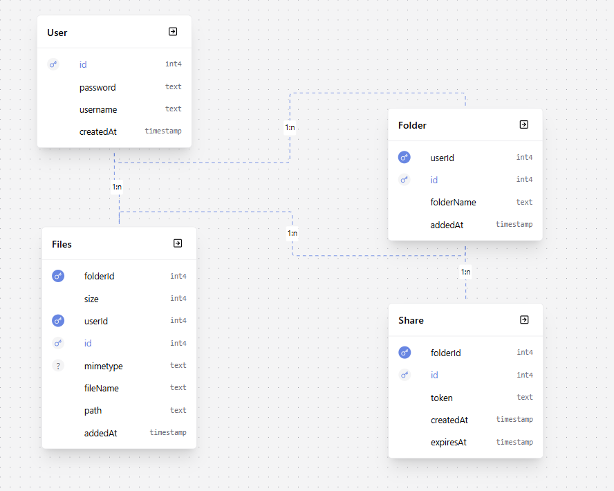

# FileUploader

FileUploader is a simple full-stack web application for managing files and organizing them into folders. It allows users to upload, store, and share files through generated public links.

The project includes authentication (registration and login), a folder-based file structure, and basic sharing functionality.

Users can create folders, upload multiple files into them, view file details, download files, and generate shareable links that provide public access to selected folders and their contents.

A test user is available for quick access:

- Login: test
- Password: Password12


## Tech Stack

This project is built using a lightweight Node.js ecosystem designed for server-side rendering and relational data management.

The backend is powered by Express, handling routing, authentication, and core application logic. Prisma is used as an ORM layer to interact with a PostgreSQL database in a type-safe way. EJS is used for server-side rendering of views, keeping the UI closely tied to backend data. File uploads and storage are managed through Multer and Cloudinary integration, allowing efficient handling of user files and media.

Session-based authentication is implemented to manage user access across the application.


## Core Entities

The system is built around four main entities: users, folders, files, and shared access links.

**User** represents an authenticated account in the system. Each user can create folders and upload files. All uploaded content is tied to a specific user for ownership and access control.

**Folder** is the primary structure for organizing files. A user can create multiple folders, each acting as a container for uploaded files. Folders are also the main unit for sharing.

**Files** represent uploaded documents stored in the system. Each file belongs to both a user and a folder. It contains metadata such as file name, size, storage path, and MIME type, which allows proper display and download handling.

**Share** is a temporary access layer that allows folders to be shared via a unique token. Anyone with a valid link can access the folder contents without authentication until the link expires.




## Getting Started

To run the project locally, start by cloning the repository and installing dependencies.

After cloning, install all required packages using your package manager. The project relies on standard Node.js dependencies defined in `package.json`.

Next, create an environment configuration file. You can copy `.env.example` and rename it to `.env`, then fill in the required values:

DATABASE_URL=

CLOUDINARY_CLOUD_NAME=

CLOUDINARY_API_KEY=

CLOUDINARY_API_SECRET=


These values are required for database connection and file storage integration.

Once environment variables are set, generate the Prisma client to ensure the database schema is properly connected to the application.

After that, start the development server. You can run it in normal mode or in watch mode for automatic restarts during development.

For deployment (for example on Render), the project is built and started using the following commands:

- Build command:
```bash
  npx prisma generate
```

- Start command:
```bash
  node --watch app.js
```

